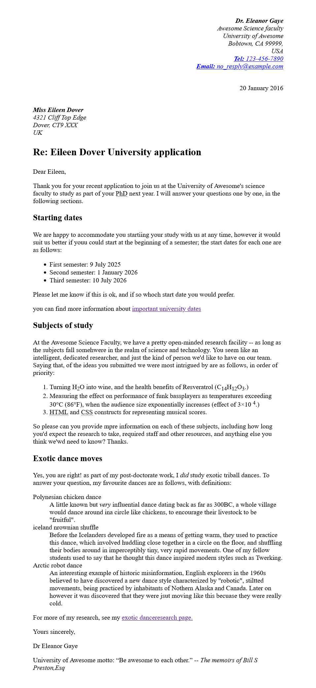

# Markup Letter (HTML Task)

This task involves marking up a formal letter using semantic HTML elements.

## What I learned

- Usage of semantic tags like `<section>`, `<article>`, `<address>`, `<header>`, and `<footer>`
- Structuring real-world content
- Inline formatting (superscript, abbreviation, quotes)

## Files

- `markup.html` – The HTML structure of the letter
- `markup.css` – Styling for the layout and typography

## Screenshot

## Screenshot

